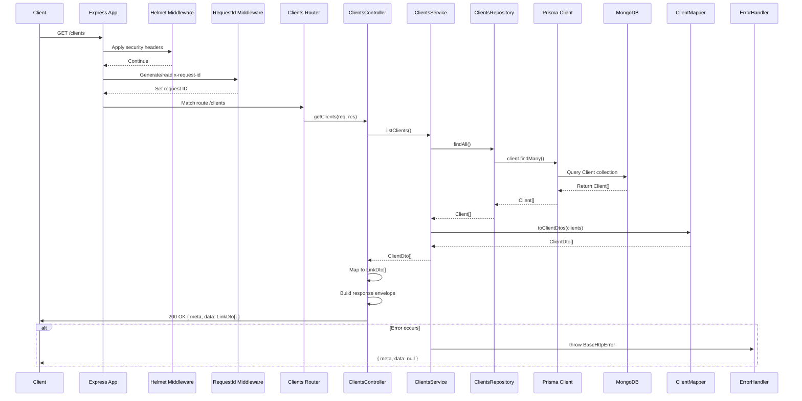

## express-ts-skeleton-app

TypeScript + Express 5 + Prisma (MongoDB) skeleton with a small clients domain. It follows a layered flow (router → controller → service → repository → Prisma), ships a single Prisma client, typed HTTP errors, request correlation ids, and a consistent API envelope with hypermedia links for collections.

### Prerequisites
- Node.js LTS and npm
- MongoDB with a replica set (Docker Compose provided)
- Optional: Docker Desktop for local MongoDB/mongo-express

### Environment
Create a `.env` in the repo root:
```
DATABASE_URL="mongodb://localhost:27017/ts-express-prisma-template?replicaSet=rs0"
PORT=3010
```
For MongoDB Atlas, use the `mongodb+srv://...` connection string (replica set handled by Atlas).

### Getting started
1) Install dependencies: `npm install`
2) Start MongoDB (Docker): `docker-compose up -d mongo`
3) Initialize the replica set (first time only):
```bash
docker exec $(docker-compose ps -q mongo) mongosh --quiet --eval "try { rs.status() } catch(e) { rs.initiate({_id:'rs0',members:[{_id:0,host:'localhost:27017'}]}) }"
```
4) Generate the Prisma client and sync the schema:
   - `npx prisma generate`
   - `npx prisma db push`  # MongoDB uses `db push` instead of migrations
5) Seed sample data: `npx prisma db seed`  # seeds Clients
6) Run the API:
   - Dev (watch): `npm run dev` (nodemon + tsx)
   - Prod: `npm run start` (tsx)

Environment variables are loaded via dotenv; `src/db/prisma.ts` throws if `DATABASE_URL` is missing. Port defaults to 3010 when unset.

### Scripts
- `dev` starts Express with nodemon + tsx
- `start` runs the app with tsx
- `postinstall` runs `prisma generate` (client emitted to `prisma/generated/prisma`)

### Prisma
- Schema: `prisma/schema.prisma` (MongoDB provider, Prisma 6 with classic engine)
- Config: `prisma.config.ts` loads `.env`, points migrations to `prisma/migrations`, and keeps the classic engine until Mongo is supported in the new runtime.
- Generated client lives at `prisma/generated/prisma` (see imports in `src/db/prisma.ts` and `src/modules/clients/seed.ts`)
- MongoDB uses `prisma db push`; SQL-style migrations are not used.
- Seed entry: `prisma/seed.ts` delegates to `src/modules/clients/seed.ts`.

### Architecture
- `src/start.ts` – bootstraps Express, Helmet, request correlation id middleware, body parsers, module routes, 404 passthrough, and the global error handler.
- `src/db/prisma.ts` – development-safe Prisma singleton that logs more in dev and caches the client to avoid excess connections.
- `src/common/errors` – typed HTTP errors plus `errorHandler` that returns `{ meta, data: null }` with the correct status.
- `src/common/utils` – response envelope helpers (`ok`, `created`, `noContent`, `buildMeta`), URL builder for hypermedia links, and MongoDB ObjectId validation.
- `src/common/middleware` – `requestId` ensures every request/response has an `x-request-id`.
- `src/modules/clients` – router, controller, service, repository, DTOs, mapper, types, and seed data for the sample Clients domain.

### API shape
All responses share the envelope `{ meta, data }`:
```json
{
  "meta": {
    "status": 200,
    "path": "/clients",
    "method": "GET",
    "timestamp": "2025-01-01T12:00:00.000Z",
    "requestId": "uuid",
    "title": "All clients",
    "count": 10
  },
  "data": [...]
}
```
- `GET /clients` → returns an array of `LinkDto` (`href`, `rel`, `title`) pointing to each client resource.
- `GET /clients/:id` → returns a `ClientDto`; ids must be 24-char hex ObjectIds. Invalid ids raise `400 Bad Request`, missing clients raise `404 Not Found`.

### Request flow
The layered flow for `GET /clients` is:


### Docker
- Start services: `docker-compose up -d` (Mongo, mongo-express, and a dev Node container)
- Stop services: `docker-compose down`
- Logs: `docker-compose logs -f [service]`
- mongo-express UI: http://localhost:8081 (admin/pass)
- Replica set helper (if needed again): command from "Getting started" step 3.

### Development notes
- ESM only (`"type": "module"`), imports use `.js` extensions.
- No compiled output in dev; code runs through tsx.
- `requestId` header is echoed back in responses; `buildMeta` also captures pagination fields when provided.
